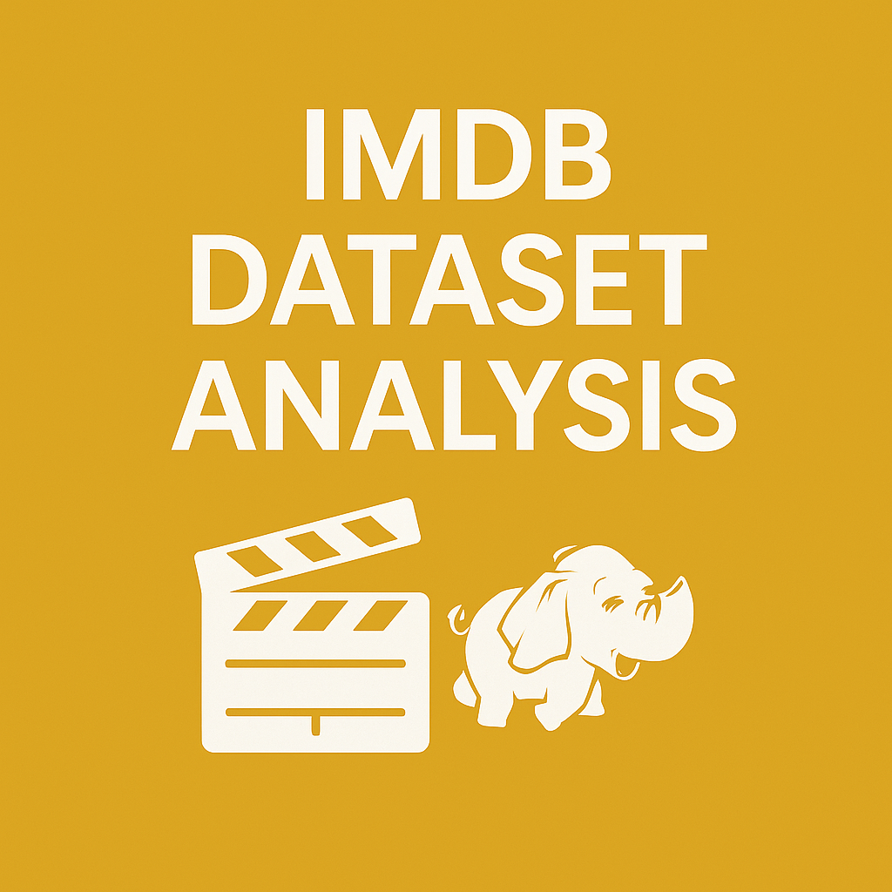

# 🎬 IMDb Data Analysis – MapReduce + SQL Optimization
 

An **integrated data analytics and engineering project** combining **Apache Hadoop MapReduce**, **Oracle SQL**, and **Python-based visualization** to extract meaningful insights from the **IMDb movie dataset**. This project was developed in **Spring 2025** as part of **CSE 4331/5331: Database Systems Models and Implementation** at **The University of Texas at Arlington** 🎓.

Quickly evolving media platforms generate vast volumes of content data — from genres and release years to user ratings and watch counts. This project simulates a real-world media analytics workflow by analyzing such data at scale, leveraging both **distributed computing** and **relational database systems** to answer a central question:

> _"What genre combinations have historically produced the highest-rated films across the last three decades?"_

The project was completed in two major parts:

- **🗃️ Part 1: Hadoop MapReduce**
  - A custom Java program processes raw IMDb data to filter **highly rated films (rating ≥ 7.0)**.
  - It segments and aggregates genre-based combinations across **three decades**:  
    **1991–2000**, **2001–2010**, **2011–2020**.
  - Output data is grouped and written as intermediate results.

- **🧠 Part 2: SQL Query Optimization**
  - An optimized SQL query runs on an **Oracle database** hosting IMDb schema tables.
  - Using **nested queries**, **grouping**, and `EXPLAIN PLAN`, we identify the **top-rated movies** matching selected genre combinations.
  - Results are refined, analyzed, and compared using **execution plans and cost metrics**.

- **📈 Final Phase: Data Visualization**
  - Python scripts using **matplotlib** transform both MapReduce and SQL outputs into clear, comparative **bar charts** and **line graphs**.
  - These visualizations illustrate rating trends and genre performance over time.

The project reflects core software engineering competencies including:
- Building and compiling Hadoop-compatible Java code
- Writing multi-step SQL queries and analyzing performance
- Structuring complex ETL pipelines across technologies
- Presenting results in professional data story formats

---

